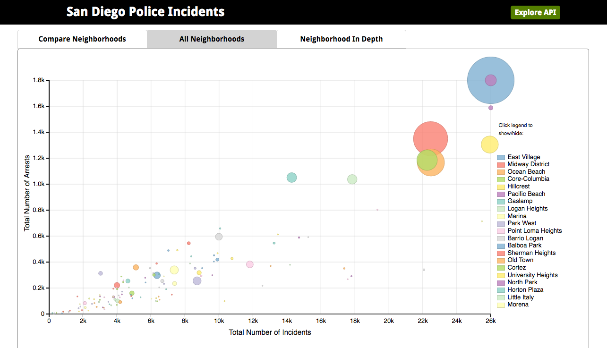
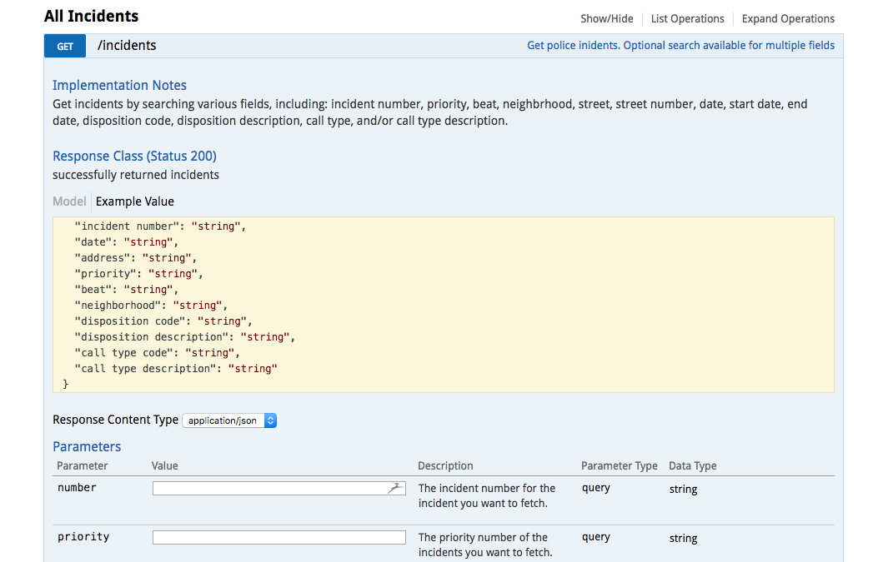

### Project Goals:

* make City of San Diego police incident data accessible, searchable and useable via API as well as access to a relational database dump file.
* help members of the public build effective search queries through interactive API documentation
* help users visualize the data with charts


### Learning Goals:
This project represents my final project at Turing.  The project spec required that we pursue new technologies that were outside the curriculum. I chose to develop an app completely in Node/Express - with both server side and client side Javascript.  I also chose to explore D3 and libraries built on top of D3 for data visualization.  This was my first time using all of the following technologies:

* Node/express
* Sequelize as the ORM
* D3 for charting
* Dimple JS for charting
* Node Cache Manager to cache data for charts
* Swagger for API documentation

Note: D3-only is a branch with some WIP D3-only charts (i.e. no Dimple).  I plan to keep working on these and see if I can recreate all of the charts only using D3.


### Production
[Production Site](https://sandiego-police-data.herokuapp.com)
| [API documentation](https://sandiego-police-data.herokuapp.com/documentation)






API endpoints:
```
/api/v1/incidents
/api/v1/beats
/api/v1/dispositions
/api/v1/call_types  
```

the `/api/v1/incidents` endpoint takes a number of optional search params:
```
number
priority
beat
neighborhood
disp_code
disp_desc
call_code
call_desc
street
street_number
date
start_date
end_date
```

Resources:
[raw data sets - CSV format](http://data.sandiego.gov/dataset/police-calls-service) |
[PG database dump]()  - TBP can import into a postgres DB

### Notes/Next Steps:  
The CSV data is updated weekly from the City of San Diego.  The data required extensive cleaning and normalizing for the purposes of this project.  I have notes on the cleaning and normalizing process that I followed, which I would like to include on the project site.  I would also like to identify a process for routine updates to the database based on updated CSV data from the City.
